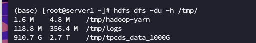
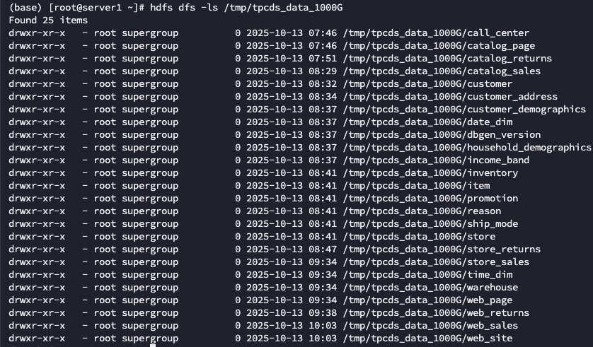
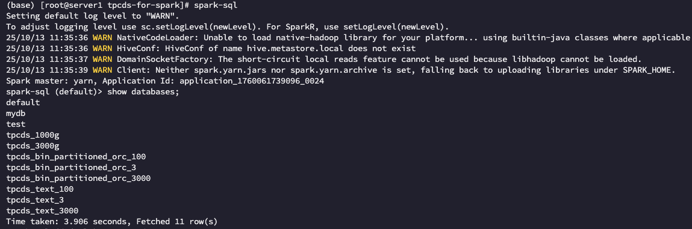
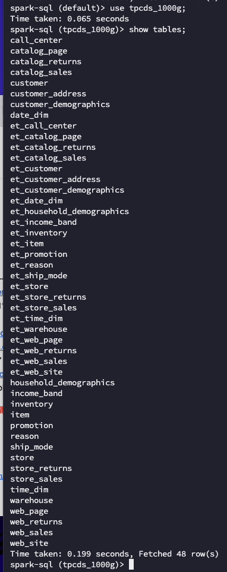
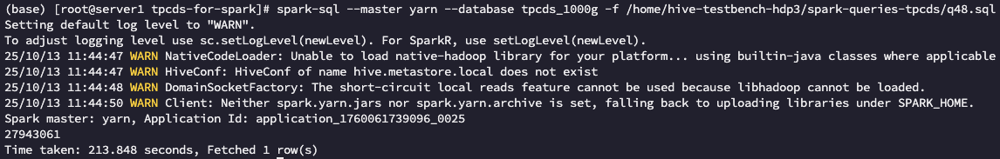
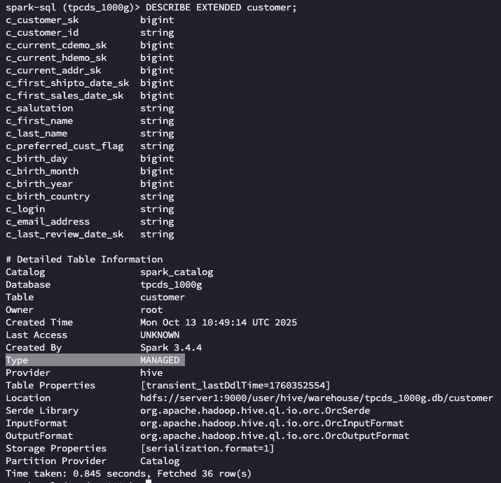
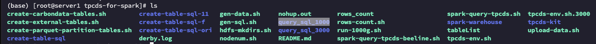

# Data Generation
## TPC-DS
### 数据生成
准备工作
```bash
# data1至data12挂载在sda至sdl下，每次导可以使用不同的 `datax` 做一下区分
mkdir -p /srv/BigData/hadoop/data1/tpcds-for-spark/Data1

vim tpcds-env.sh

############### 要修改内容如下 ###############
export FLATFILE_HDFS_ROOT=/tmp/tpcds_data_1000G
export TPCDS_SCALE_FACTOR=1000

# 本地存放文件的根目录地址，目前有data1至data12。
# 要像上面一样先把文件夹创建出来不然会出问题
export LOCAL_DATA_DIR=/srv/BigData/hadoop/data1/tpcds-for-spark/Data

export TPCDS_DBNAME=tpcds_1000G
#############################################
```

⽣成本地dat数据（这里开始下面的所有sh脚本都不需要修改，每次会自动读取前面修改过的 `tpcds-env.sh` 里面定义的环境变量）
```bash
sh gen-data.sh  # 生成时间视数据量而定
ps -ef | grep dsdgen | grep -v grep # 查看数据生成是否完成，为空即完成
pkill -9 dsdgen # 如果gen-data.sh报错后除了杀掉前台运行进程，还要杀掉后台的dsdggen进程
```

创建hdfs⽬录，查看是否创建成功
```bash
sh hdfs-mkdirs.sh
hdfs dfs -ls /tmp/tpcds_data_1000G
```


上传数据到hdfs
```bash
sh upload-data.sh
hdfs dfs -du -h /tmp/
```


这时候执行spark-sql，使用 `show databases;` 没看到 `tpcds_1000g` 是正常的

创建外部表和对事实表进行格式化以及压缩
```bash
sh create-external-tables.sh    # 创建外部表，比较快
sh create-parquet-partition-tables.sh   # 创建分区表，有点久多等一会
```

检查一下





测试一下
```bash
spark-sql --master yarn --database tpcds_1000g -f /home/hive-testbench-hdp3/spark-queries-tpcds/q48.sql
```


关于前面生成的dat文件能不能删掉：
已经把数据拷贝到warehouse了，即表的type字段为MANAGED，就可以删掉了，查询方法如下


### 查询生成

dsqgen生成的不同数据大小对应的查询模版都是固定的，只是查询中部分常数不同，查询性能的变化只依赖于数据规模。已统一处理，不用管。